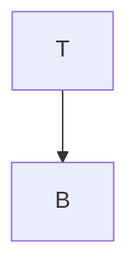
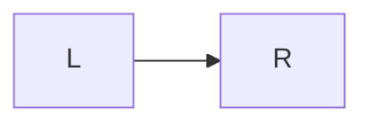
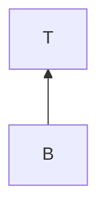
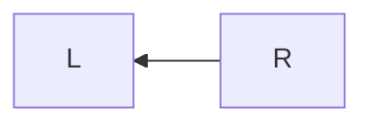

# vitepress markdown for `details` and `mermaid`

## steps
1. use mpress-mdi-details.details
2. use mpress-mdi-details.mermaid
3. load mermadjs in Layout
4. mermaid.init in enhanceApp

## containers - tip

::: tip

This is a tip

:::

## containers - details

::: details code use `mermaid` as language
```
pie title Pets adopted by volunteers
```
:::

## mermaids

### graphs fence









### graphs component
<mermaid />
