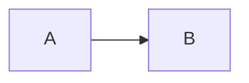
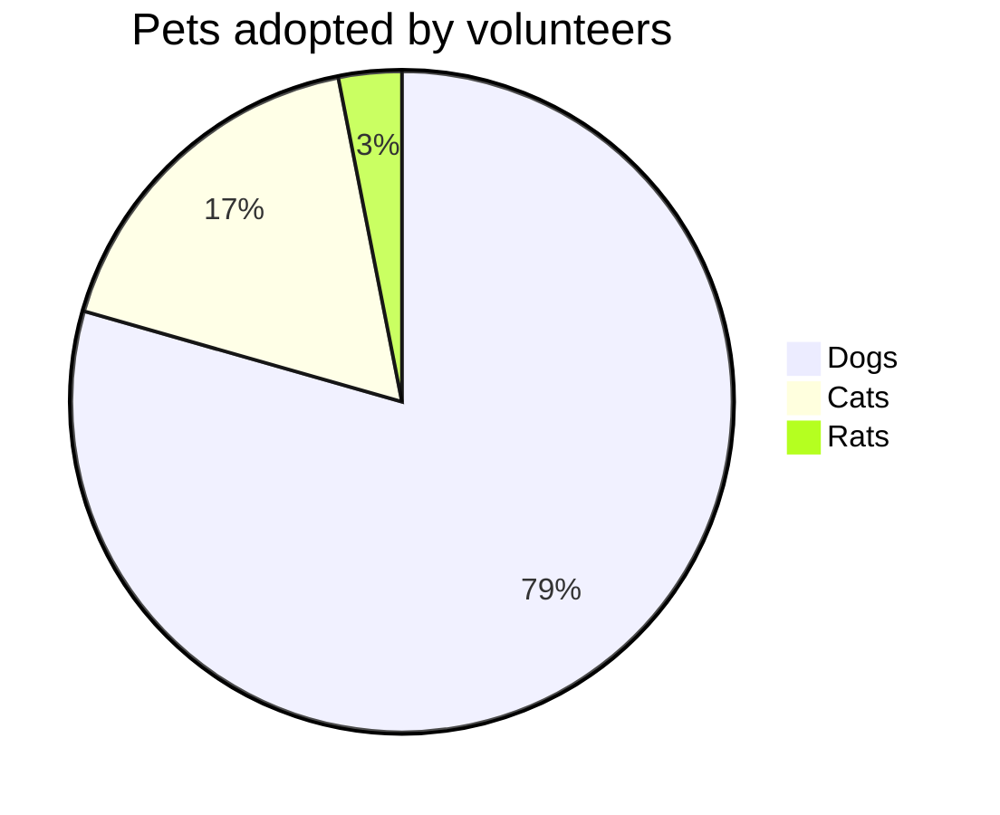

# vitepress markdown for `details` and `mermaid`

## steps
1. use mpress-mdi-details.details
2. use mpress-mdi-details.mermaid
3. load mermadjs in Layout
4. mermaid.init in enhanceApp

## containers

::: tip

This is a tip

:::

## mermaid

::: details code use mermaid as language
```
pie title Pets adopted by volunteers
    "Dogs" : 386
    "Cats" : 85
    "Rats" : 15
```
:::

### flowchart



### pie chart


