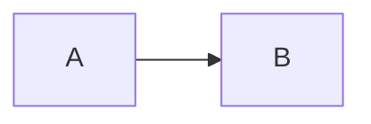
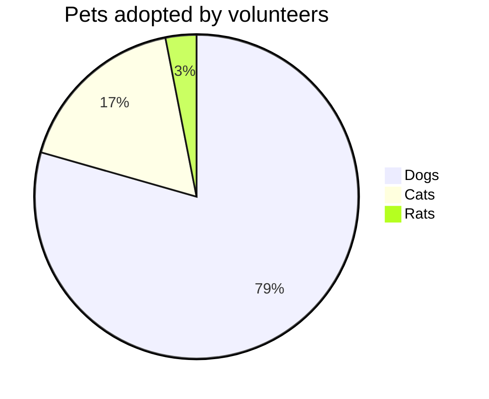

# vitepress markdown for `details` and `mermaid`

## containers

::: tip
This is a tip
:::

## mermaid

::: details code use mermaid as language
```
pie title Pets adopted by volunteers
    "Dogs" : 386
    "Cats" : 85
    "Rats" : 15
```
:::




